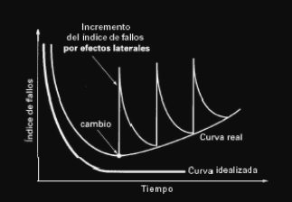
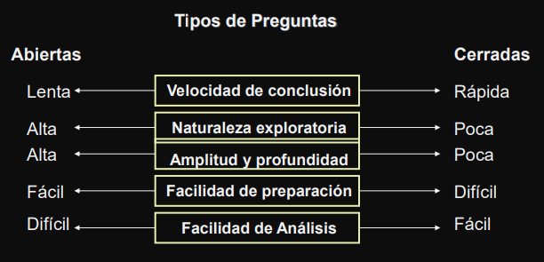
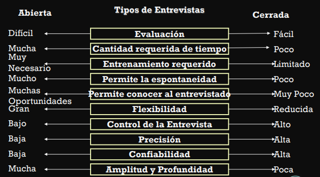

 

<h1 align="center"> 📋 Teoria 1er Parcial</h1>

[Practica 1 | Teoria](/Documentos/Practica1.md) 
[Practica 2 | Historias de Usuario](/Documentos/Practica2.md) 
[Practica 3 | Casos de Uso](/Documentos/Practica3.md) 
[Practica 4 | DTE](/Documentos/Practica4.md) 
[Practica 5 | Redes de Petri](/Documentos/Practica5.md) 
[Practica 6 | Tablas de Desición](/Documentos/Practica6.md)

- [Software](#software)
    - [Qué es Software?](#qué-es-software)
    - [Tipos de Productos de Software](#tipos-de-productos-de-software)
    - [Clasificación de Software](#clasificación-de-software)
    - [Características del Software](#características-del-software)
    - [Evolución del software](#evolución-del-software)
    - [¿Qué es la ingeniería de software?](#¿qué-es-la-ingeniería-de-software)
    - [¿Qué conocimientos debe tener un IS?](#qué-conocimientos-debe-tener-un-is)
    - [Responsabilidad Profesional y Ética](#responsabilidad-profesional-y-ética)
    - [La comunicación](#la-comunicación)
    - [Requerimientos](#requerimientos)
    - [Puntos de Vista](#puntos-de-vista)
- [Elicitación de Requerimientos](#elicitación-de-requerimientos)
    - [Técnicas de elicitación](#técnicas-de-elicitación)
    - [Muestreo de la documentación, las formas y los datos existentes](#muestreo-de-la-documentación-las-formas-y-los-datos-existentes)
    - [Investigación y visitas al sitio](#investigación-y-visitas-al-sitio)
    - [Observación del ambiente de trabajo](#observación-del-ambiente-de-trabajo)
    - [Cuestionarios](#cuestionarios)
        - [Tipos de Cuestionario](#tipos-de-cuestionario)
        - [Tipo de información obtenida](#tipo-de-información-obtenida)
        - [Cuándo usar Cuestionarios](#cuándo-usar-cuestionarios)
        - [Diseño de un Cuestionario](#diseño-de-un-cuestionario)
        - [Procedimiento para el desarrollo](#procedimiento-para-el-desarrollo)
        - [Redacción de un Cuestionario](#redacción-de-un-cuestionario)
    - [Entrevistas](#entrevistas)
        - [Tipos de Entrevistas](#tipos-de-preguntas)
        - [Tipos de Preguntas](#tipos-de-preguntas)
        - [Como conducir una entrevista](#cómo-conducir-una-entrevista)
        - [Preparación Previa](#prepraración-previa)
        - [Conducción de la entrevista](#conducción-de-la-entrevista)
    - [Planeación conjunta de requerimiento](#planeación-conjunta-de-requerimiento-jrp)
    - [Lluvia de Ideas](#lluvia-de-ideas)

# Software

### Qué es Software?

Es el conjunto de los programas de cómputo, procedimientos, reglas, documentación y datos asociados que forman parte de las operaciones de un sistema de computación

---

### Tipos de Productos de Software
- `Genericos` Sistemas aislados producidos por organizaciones desarrolladoras de software y que se venden en un mercado abierto.
- `Personalizados` Sistemas requeridos por un cliente en particular. Desarrollados por la propia organización interesada o un contratista.

---

### Clasificación de Software

- `De sistemas` (sirve a otros programas)
- `De gestión` (proceso de información comercial)
- `Científico` (algoritmos de manejo de números)
- `Empotrado` (reside en memoria)
- `De tiempo real` (coordina/analiza/controla sucesos del mundo real)
- `Basados en la Web` (sitios)
- `De Inteligencia artificial` (uso de algoritmos no numéricos para resolver problemas complejos)

---
### Características del Software

- Es un elemento lógico
- El software se desarrolla, no se fabrica como otros productos
    - Mayor costo en la ingeniería que en la producción.
    - Tendencia importante de construcción por componentes, pero aún se construyen a medida

--- 

### Evolución del software 

- El software no se desgasta.
- No sigue una curva clásica de envejecimiento.
- Es inmune a los males que desgastan al hardware.
- El problema no está en el tiempo de operación, sino en los cambios. 

---

#### ¿Qué es la ingeniería de software?

Disciplina de la ingeniería que comprende todos los aspectos de la producción de software desde las etapas iniciales de la especificación del sistema incluyendo la evolución de éste luego que se comienza a ejecutar.

- `Disciplina de la ingeniería`
    - Hace que las cosas funcionen.
    - Se aplican teorías, métodos y herramientas.
- `Todos los aspectos de la producción de software`
    - No sólo comprende los procesos técnicos del desarrollo de software, sino también se realizan actividades como la gestión de proyectos y el desarrollo de herramientas, métodos y teorías de apoyo a la producción de software
- `La IEEE define a la Ingeniería de Software como`
    - El uso de métodos sistemáticos, disciplinados y cuantificables para el desarrollo, operación y mantenimiento de software
    - El estudio de técnicas relacionadas con lo anterior
- `Richard Fairley propone`
    - La Ingeniería de Software es la disciplina tecnológica y de administración que se ocupa de la producción y evolución sistemática de productos de software que son desarrollados y modificados dentro de los tiempos y costos estimados
- `Usa métodos sistemáticos “Cuantificables”`
    - La cuantificación rigurosa de recursos, procesos y productos es una precondición para optimizar productividad y calidad. La “metrificación” y el control estadístico de procesos son claves en Ingeniería de Software
- `“Dentro de tiempos y costos estimados”`
    - Un Ingeniero de Software debe cumplir contratos en tiempo y costos como es normal en obras de Ingeniería. Ello presupone la capacidad de medir, estimar, planificar y administrar proyectos
- `Para el “Desarrollo, operación y mantenimiento”`
    - La Ingeniería de Software se ocupa de todo el ciclo de vida de un producto, desde su etapa inicial de planificación y análisis de requerimientos hasta la estrategia para determinar cuándo y cómo debe ser retirado de servicio
- La Ingeniería de Software surgió como reacción a las dificultades de desarrollar software sobre la base de habilidad, experiencia o intuición individuales
- La aplicación de “métodos sistemáticos” y repetibles permite la producción y evolución de software por organizaciones distribuidas geográficamente y en el tiempo.
- La aplicación de estándares facilita la integración, reusabilidad mantenimiento de los productos
- Es una “Disciplina tecnológica y de administración” 

Existen elementos que distinguen a la Ingeniería de Software de las ciencias de la computación
- Ciencia de la computación
    - Se refiere a las teorías y métodos subyacentes a las computadoras y los sistemas de software
- Los IS requieren ciertos conocimiento de la ciencia de la computación

La Ingeniería de Software es una disciplina de “producción y evolución” de productos, no trata temas abstractos

#### En resumen

- La ingeniería de software trata de dar principios y métodos que permitan producir software confiable y eficiente, al menor costo posible.
- Para esto la ingeniería de software establece métodos, desarrolla herramientas automáticas o semiautomáticas y define procedimientos que establecen la relación de métodos y herramientas.

---

### Qué conocimientos debe tener un IS?

- `1)` Tener una combinación de conocimientos científicos, metodológicos, tecnológicos y administrativos.
- `2)` Estar familiarizado con la aplicación de métodos formales: lógica, estadística, simulación y con el uso de notaciones de modelización, especificación, diseño, programación
- `3)` Poder aplicar metodologías de documentación, análisis, especificación, diseño, implementación y prueba. Debe conocer las ventajas y limitaciones de cada notación y cada técnica. Debe saber cómo y cuándo aplicarlas.
- `4)` Conocer las tecnologías y productos: sistemas operativos, lenguajes, herramientas CASE, bases de datos, sistemas generadores de interfaces, bibliotecas de código.
- `5)` Conocer técnicas de administración de proyectos: planificación, análisis de riesgos, control de calidad, seguimiento de proyectos, control de subcontratistas, etc.
- `6)` En los últimos años se observa una especialización de los ingenieros de software por dominio de aplicación o por actividad

---

### Responsabilidad Profesional y Ética

- La Ingeniería de Software se desarrolla en un marco económico, social y legal.
    - Los IS deben aceptar responsabilidades más amplias que las responsabilidades técnicas
- No debe utilizar sus capacidad y habilidades de forma deshonesta, o de forma que deshonre la profesión. 
- `Confidencialidad` Respetar la confidencialidad de sus empleados y clientes
- `Competencia` No falsificar el nivel de competencia y aceptar responsabilidades fuera de su capacidad
- `Derechos de la propiedad intelectual` Conocer la leyes vigentes sobre las patentes y copyright
- `Uso inapropiado de las computadoras` No debe utilizar sus habilidades técnicas para utilizar de forma inapropiada otras computadoras

Existen diferentes organización cono ACM o IEEE que sugieren diferentes códigos de ética a respetar

---

### La comunicación

- La comunicación es la base para la obtención de las necesidades del cliente
- Es la principal fuente de error
    - Falta de procedimientos y guías formales.
    - Falta de participación del usuario.
    - Mala interpretación de las necesidades
    - Falta de comunicación.
- Al hablar de necesidades, en términos mas técnicos estamos hablando de requerimientos

---

### Requerimientos

- Un Requerimiento (o requisito) es una característica del sistema o una descripción de algo que el sistema es capaz de hacer con el objeto de satisfacer el propósito del sistema
- Definición IEEE-Std-610
    - `1)` Condición o capacidad que necesita el usuario para resolver un problema o alcanzar un objetivo
    - `2)` Condición o capacidad que debe satisfacer o poseer un sistema o una componente de un sistema para satisfacer un contrato, un estándar, una especificación u otro documento formalmente impuesto.
    - `3)` Representación documentada de una condición o capacidad como en 1 o 2.
- Fuentes de Requerimientos
    - Documentación
    - Los stakeholder
        - El termino Stakeholder se utiliza para referirse a cualquier persona o grupo que se vera afectado por el sistema, directa o indirectamente.
        - Entre los Stakeholders se encuentran:
            - Usuarios finales, Ingenieros, Gerentes, Expertos del dominio
- Especificaciones de sistemas similares

---

### Puntos de Vista

Clasificar los stakeholders según los punto de vista:
- Punto de vista de los interactuadores: representan a las personas u otros sistemas que interactúan directamente con el sistema. Pueden influir en los requerimientos del sistema de algún modo.
- Punto de vista indirecto: representan a los stakeholders que no utilizan el sistema ellos mismos pero que influyen en los requerimientos de algún modo.
- Punto de vista del dominio: representan las características y restricciones del dominio que influyen en los requerimientos del sistema.
- Su identificación puede ser difícil.
- Los mas específicos son:
    - `1)` Los proveedores de servicios al sistema, los receptores de servicios del sistema
    - `2)` Los sistemas que deben interactuar
    - `3)` Las regulaciones y estándares a aplicar
    - `4)` Las fuentes de requerimientos
    - `5)` Los puntos de vista de las personas que lo van a desarrollar, administrar y mantener.
    - `6)` Puntos de vista del marketing y otros que generan requerimientos sobre las
características del sistema

---

# Elicitación de Requerimientos

Es el proceso de adquirir (“eliciting”) [sonsacar] todo el conocimiento relevante necesario para producir un modelo de los requerimientos de un dominio de problema

`Objetivos`
- Conocer el dominio del problema para poder comunicarse con clientes y usuarios y entender sus necesidades.
- Conocer el sistema actual (manual o informatizado).
- Identificar las necesidades, tanto explícitas como implícitas, de clientes y usuarios y sus expectativas sobre el sistema a desarrollar.

`Conceptos`

- La elicitación de requisitos es una actividad principalmente de carácter social, mucho más que tecnológico.
- Los problemas que se plantean son por tanto de naturaleza psicológica y social, más
que técnicos.
- **Problemas de comunicación (Del cliente)**
    - Dificultad para expresar claramente las necesidades.
    - No ser conscientes de sus propias necesidades.
    - No entender cómo la tecnología puede ayudar.
    - Miedo a parecer incompetentes por ignorancia tecnológica.
    - No tomar decisiones por no poder prever las consecuencias, no entender las alternativas o no tener una visión global.
- **Problemas de comunicación (Del desarrollador)**
    - Cultura y vocabulario diferentes.
    - Intereses distintos en el sistema a desarrollar.
    - Medios de comunicación inadecuados (diagramas
    - que no entienden los clientes y usuarios).
    - Conflictos personales o políticos.
- **Limitaciones cognitivas (Del desarrollador)**
    - No conocer el dominio del problema.
    - Hacer suposiciones sobre el dominio del problema.
    - Hacer suposiciones sobre aspectos tecnológicos.
    - Hacer simplificaciones excesivas.
- **Conducta humana**
    - Conflictos y ambigüedades en los roles de los participantes.
    - Pasividad de clientes, usuarios o ingenieros de requisitos.
    - Temor a que el nuevo sistema lo deje sin trabajo.
- **Técnicos**
    - Complejidad del dominio del problema.
    - Complejidad de los requisitos.
    - Múltiples fuentes de requisitos.
    - Fuentes de información poco claras.

---

### Técnicas de elicitación

Recopilación de información

**Métodos discretos**
- `1)` Muestreo de la documentación, los formularios y los datos existentes.
- `2)` Investigación y visitas al lugar.
- `3)` Observación del ambiente de trabajo.

**Métodos interactivos**
- `1)` Cuestionarios.
- `2)` Entrevistas.
- `3)` Planeación conjunta de Requerimientos (JRP o JAD).
- `4)` Lluvia de Ideas - Brainstorming

---

### Muestreo de la documentación, las formas y los datos existentes

**Recolección de hechos a partir de la documentación existente**
- ¿Qué tipo de documentos pueden enseñar algo acerca del sistema?
    - Organigrama (identificar el propietario, usuarios claves)
    - Memos, notas internas, minutas, registros contables
    - Solicitudes de proyectos de sistemas de información anteriores
- Permiten conocer el historial que origina el proyecto
- Documentos que describen la funcionalidad del negocio que esta siendo analizada
    - Declaración de la misión y plan estratégico de la organización
    - Objetivos formales del departamento en cuestión
    - Políticas, restricciones, procedimientos operativos
    - Formularios de operaciones realizadas
    - Bases de Datos
    - Sistemas en funcionamiento
- Documentación de sistemas anteriores
    - Diagramas
    - Diccionario o Repositorios de proyecto
    - Documentos de diseño
    - Manuales de operación y/o entrenamiento
- Técnicas de muestreo de documentos y archivos

---

### Investigación y visitas al sitio

- Investigar el dominio
- Patrones de soluciones (mismo problema en otra organización)
- Revistas especializadas
- Buscar problemas similares en internet
- Consultar otras organizaciones

---

### Observación del ambiente de trabajo

El analista se convierte en observador de las personas y actividades con el objeto de aprender acerca del sistema

**Lineamientos de la observación:**
- Determinar quién y cuándo será observado
- Obtener el permiso de la persona y explicar el porqué será observado
- Mantener bajo perfil
- Tomar nota de lo observado
- Revisar las notas con la persona apropiada
- No interrumpir a la persona en su trabajo

**Ventajas**
- Datos confiables
- El analista puede ver exactamente lo que se hace (tareas difíciles de explicar con palabras)
- Análisis de disposiciones físicas, tránsito, iluminación, ruido
- Económica en comparación con otras técnicas

**Desventajas**
- La gente se siente incómoda siendo observada
- Algunas actividades del sistema pueden ser realizadas en horarios incómodos
- Las tareas están sujetas a interrupciones
- Tener en cuenta que la persona observada puede estar realizando las tareas de la forma “correcta” y no como lo hace habitualmente

---

### Cuestionarios

- Documento que permite al analista recabar información y opiniones de los encuestados
    - Recolectar hechos de un gran número de personas
    - Detectar un seguimiento generalizado
    - Detectar problemas entre usuarios
    - Cuantificar respuestas
- `Ventajas`
    - Respuesta rápida
    - Económicos
    - Anónimos
    - Estructurados de fácil análisis
- `Desventajas`
    - Número bajo de respuestas
    - No responde a todas las preguntas
    - Preguntas rígidas
    - No se puede analizar el análisis corporal
    - No se pueden aclarar respuestas incompletas
    - Difíciles de preparar

---

#### Tipos de Cuestionario
**Formato libre (Abiertos)**
- Diseñado para ofrecer al encuestado más flexibilidad en la respuesta
- ¿Qué reportes recibe actualmente?
- ¿Hay problemas con los reportes?

**Formato fijo (Cerrados)**
- Requieren la selección de una respuesta entre respuestas posibles predefinidas
- ¿Es útil el reporte que utiliza actualmente? SI NO

---

#### Tipo de información obtenida

- `Actitud` Lo que las personas dicen que quieren
- `Creencias` Lo que las personas creen que es verdad
- `Comportamiento` Lo que realmente hacen
- `Características` De las personas o cosas

---

#### Cuándo usar Cuestionarios
- `Las personas están dispersas` Diferentes oficinas o ciudades
- `Muchas de personas involucradas` Clientes o usuarios
- Queremos obtener opiniones generales
- Queremos identificar problemas generales

---

#### Diseño de un Cuestionario
- Los buenos cuestionarios son difíciles de desarrollar
- `Deje espacio en blanco` El cuestionario debe estar bien distribuido
- `Espacio suficiente para responder` No es lo mismo el espacio para responder los años de antigüedad, que para la descripción de su tarea
- `Facilitar el marcado de las respuestas`
    - Cuando se trata de opciones se debe poder indicar de forma clara la opción seleccionada
    - Utilizar escalas Nominales (Selección de opciones) o Intervalos (1…5)
- `Mantener el estilo` Es importante la apariencia del cuestionario
- `Orden de las preguntas` Primero las pregunta importantes para los encuestados
- `Agrupar por contenido similar` Uso de tendencias asociativas
- Plantear primero temas menos controvertidos

---

#### Procedimiento para el desarrollo
- `1)` Determinar qué hechos, opiniones y de quién, quieren recolectarse
- `2)` Determinar qué tipo de preguntas dan mejores resultados a los hechos buscados
- `3)` Escribir las preguntas y examinarlas en cuanto a errores o malas interpretaciones. No proveer un sesgo personal en la pregunta.
- `4)` Ensayar en una pequeña muestra de encuestados
- `5)` Duplicar y distribuir el cuestionario

---

#### Redacción de un Cuestionario
- `Claridad` La redacción del cuestionario debe ser autocontenida y precisa
- `Flujo` Debe haber un hilo conductor entre las preguntas
- `Vocabulario` Usar el lenguaje de los encuestados
- `Redacción sencilla` Evitar preguntas muy específicas
- `Preguntas breves` No subestimar a las personas a realizar el cuestionario. Tenemos que asumir que el empleado sabe lo que hace
- `Evitar la parcialidad` No incluir tendencias a una respuesta
- `Evitar preguntas ofensivas` Si el encuestado se siente ofendido, posiblemente no responda de forma correcta
- `Dirigir las preguntas a los encuestados que las pueden responder`
    - El cuestionario debe ser preparado para el grupo de personas que lo van a responder
    - No usar un Cuestionario genérico para todos

---

### Entrevistas

- Técnica de exploración mediante la cual el analista de sistemas recolecta información de las personas a través de la interacción cara a cara
- Es una conversación con un propósito especifico, que se basa en un formato de preguntas y respuestas en general
- Conocer opiniones y sentimientos del entrevistado
- **Ventajas**
    - El entrevistado se siente incluido en el proyecto
    - Es posible obtener una retroalimentación del encuestado
    - Es posible adaptar las preguntas de acuerdo al entrevistado
    - Información no verbal
        - Observando las acciones y expresiones del entrevistado
- **Desventaja**
    - Costosas
        - Tiempo y recursos humanos
    - Las entrevistas dependen en gran parte de las habilidades del entrevistador
    - No aplicable a distancia
---

#### Tipos de Entrevistas

- **Estructuradas (Cerradas)**
    - El encuestador tiene un conjunto específico de preguntas para hacérselas al entrevistado
    - Se dirige al usuario sobre un requerimiento puntual
    - No permite adquirir un amplio conocimiento del dominio
- **No estructuradas (Abiertas)**
    - El encuestador lleva a un tema en general
    - Sin preparación de preguntas específicas
    - Iniciar con preguntas que no dependen del contexto, para conocer el problema, la gente involucrada, etc

---

#### Tipos de Preguntas

#### `Abiertas`
- Permite al encuestado responder de cualquier manera
- ¿Qué opinión tiene del sistema actual?
- ¿Cómo describe su trabajo?
- `Ventajas`
    - Revelan nueva línea de preguntas
    - Hacen más interesante la entrevista
    - Permiten espontaneidad
- `Desventajas`
    - Pueden dar muchos detalles irrelevantes
    - Se puede perder el control de la entrevista
    - Parece que el entrevistador no tiene los objetivos claros

#### `Cerradas`
- Las respuestas son directas, cortas o de selección específica
- ¿Quién recibe este informe?
- ¿Cuántas personas utilizan el sistema?
- `Ventajas`
    - Ahorran tiempo
    - Se mantiene más fácil el control de la entrevista
    - Se consiguen datos relevantes
- `Desventajas`
    - Pueden aburrir al encuestado
    - No se obtienen detalles

#### `Sondeo`
- Permite obtener más detalle sobre un tema puntual
- ¿Podría dar detalles sobre…?
- ¿Podría dar un ejemplo de…?

---

#### Cómo conducir una entrevista

- Selección del entrevistado
    - Según el requerimiento a analizar
    - Conocer sus fortalezas, prejuicios y motivaciones
        - Armar la entrevista en base a las características de la persona
    - Hacer una cita (no llegar sin avisar)
    - Respetar el horario de trabajo
    - Establecer la duración de la entrevista
        - Cuanto mayor es el cargo del entrevistado menor tiempo se debe utilizar
    - Obtener el permiso del supervisor o jefe
    - La entrevista es personal y debe realizarse en un lugar privado
- Preparación de la entrevista
    - Informar al entrevistado el tema a tratar antes de la reunión
    - Definir un “Guión de Entrevista”
    - Se deben evitar preguntas sesgadas o con intención, amenazantes o críticas
    - Usar lenguaje claro y conciso
    - No incluir opinión como parte de la pregunta
    - Evitar realizar preguntas largas y complejas 

---

#### Prepraración Previa

- `1)` Leer los antecedentes. Poner atención en el lenguaje.
    - Buscar un vocabulario en común. Imprescindible para poder entender al entrevistado.
- `2)` Establecer los objetivos de la entrevista.
- Usando los antecedentes. Los directivos suelen proporcionar una visión general, mientras que los futuros usuarios una mas detallada.
- `3)` Seleccionar los entrevistados.
    - Se debe minimizar el numero de entrevistas
    - Los entrevistados deben conocer con antelación el objetivo de la entrevista y las preguntas que se le van a hacer.
- `4)` Planificación de la entrevista y preparación del entrevistado.
    - Establecer fecha, hora, lugar y duración de cada entrevista de acuerdo con el entrevistado.
- `5)` Selección del tipo de preguntas a usar y su estructura

---

### Conducción de la entrevista
- Respete el horario y los tiempos definidos
- Si es en una sala de reunión llegue antes para asegurar las condiciones de la misma
- Inicie la entrevista saludando, presentándose y agradeciendo la atención
- Mencione el propósito de la misma y la duración
- Escuche con atención y observe al entrevistado, tome nota de las respuestas verbales y no verbales
- Concluya la entrevista expresando su agradecimiento
- Haga una breve conclusión de la entrevista para ganar la confianza del entrevistado
- `Debe`
    - Vestirse adecuadamente
    - Ser cortés
    - Escuchar cuidadosamente
    - Mantener el control
    - Observar los gestos
    - Ser paciente
    - Mantener al entrevistado en calma
    - Mantener el autocontrol
    - Terminar a tiempo
- `Evite`
    - Suponer que una respuesta no lleva a ningún lado
    - Revelar pistas
    - Usar jerga
    - Revelar sesgos personales
    - Hablar en lugar de escuchar
    - Suponer cualquier cosa acerca del tema o del entrevistado
    - Uso de grabadores (señal de debilidad de escuchar)
- `Seguimiento de la entrevista`
    - Enviar al entrevistado un resumen de la entrevista, permitiendo aclarar cualquier cosa que no se haya entendido durante la entrevista
- `Cómo escuchar`
    - Saber escuchar es la parte más importante del proceso de una entrevista
    - Se debe diferenciar entre oír y escuchar 
    - Llegue con actitud positiva
        - Mejora el canal de comunicación
    - Haga que la otra persona se tranquilice
        - Romper el hielo con cuestiones cotidianas
    - Haga ver que esta escuchado lo que dice
        - Mantener el contacto visual, asentir con la cabeza, emitir comentarios
    - Haga preguntas sobre lo que dice
        - El entrevistado siente que le presta atención y puede ampliar su respuesta
    - No haga suposiciones
        - Escuche todo lo que el entrevistado tiene que explicar
    - Tome nota
        - El entrevistado percibe que está siendo escuchado
- `El lenguaje corporal`
    - Información no verbal que comunicamos
        - La mayor parte de la información se expresa a través de las expresiones corporales
        - Las más importantes son:
            - Expresiones faciales
            - Contacto visual
            - Postura

---

#### Planeación conjunta de requerimiento (JRP)

Proceso mediante el cual se conducen reuniones de grupo altamente estructurados con el propósito de analizar problemas y definir requerimientos
- Requiere de extenso entrenamiento
- Reduce el tiempo de exploración de requisitos
- Amplia participación de los integrantes
- Se trabaja sobre lo que se va generando
- Alguna bibliografía la menciona como JAD (Joint Application Design)
- **Ventajas**
    - Ahorro de tiempo
    - Usuarios involucrados
    - Desarrollos creativos
- **Desventajas**
    - Es difícil organizar los horarios de los involucrados
    - Es complejo encontrar un grupo de participantes integrados y organizados
- `Participantes de JRP`
    - `Patrocinador` Miembro de la dirección con autoridad sobre los departamentos que participan, es el responsable del proyecto, toma las decisiones finales
    - `Facilitador` Dirige las sesiones y tiene amplias habilidades de comunicación y negociación
    - `Usuarios y Gerentes` Los usuarios comunican los requerimientos y los gerentes los aprueban
    - `Secretarios` Llevan el registro de la sesión y van publicando los resultados realizados con herramientas CASE
    - `Equipos de TI` Escuchan y toman nota de los requerimientos
- Cómo planear las sesiones de JRP
    - `1)` Selección de una ubicación para las sesiones de JRP
    - `2)` Selección de los participantes
    - `3)` Preparar la agenda
- Beneficios del JRP
    - `1)` JRP involucra activamente a los usuarios y la gerencia en el proyecto de desarrollo
    - `2)` JRP reduce el tiempo de la etapa de requerimientos
    - `3)` Si se incorporan prototipos, los mismos ya confirman el diseño del sistema
---

#### Lluvia de Ideas
- Técnica para generar ideas al alentar a los participantes para que ofrezcan tantas ideas como sea posible en un corto tiempo sin ningún análisis hasta que se hayan agotado las ideas.
- Se promueve el desarrollo de ideas creativas para obtener soluciones.
- Se realizan reuniones del equipo involucrado en la resolución del problema, conducidas por un director.
- Los principios en que se basa esta técnica son:
    - “Cuantas más ideas se sugieren, mejores resultados se conseguirán”.
    - La producción de ideas en grupos puede ser más efectiva que la individual.
    - Las ideas de una persona pueden hacer que aparezcan otras por “contagio”.
    - A veces las mejores ideas aparecen tarde.
    - Es mejor elegir sobre una variedad de soluciones.
- Incluye una serie de fases de aplicación:
    - Descubrir hechos, Producir ideas, Descubrir soluciones
- Clave para resolver la falta de consenso entre usuarios
- Es útil combinarlo con la toma de decisiones
- Ayuda a entender el dominio del problema
- Encara la dificultad del usuario para transmitir
- Ayuda a entender: al usuario y al analista

---