

 

<h1 align="center"> 📋 Teoria 2da AE</h1>

[Practica 1 | Teoria](/Documentos/Practica1.md) 
[Practica 2 | Historias de Usuario](/Documentos/Practica2.md) 
[Practica 3 | Casos de Uso](/Documentos/Practica3.md) 
[Practica 4 | DTE](/Documentos/Practica4.md) 
[Practica 5 | Redes de Petri](/Documentos/Practica5.md) 
[Practica 6 | Tablas de Desición](/Documentos/Practica6.md)

- [Qué es un proceso de software?](#qué-es-un-proceso-de-software)
- [Qué es un modelo de proceso de Software?](#qué-es-un-modelo-de-proceso-de-software)
- [Cuáles son los atributos de un buen software?](#cuáles-son-los-atributos-de-un-buen-software)
- [Requerimientos](#requerimientos)
  - [Funcionales](#requerimientos-funcionales)
  - [No Funcionales](#requerimientos-no-funcionales)
- [Ingeniería de Requerimientos](#ingeniería-de-requerimientos)
  - [Estudio de Viabilidad](#estudio-de-viabilidad)
  - [Obtención y Análisis de Requerimientos](#obtención-y-análisis-de-requerimientos)
  - [Especificación de Requerimientos](#especificación-de-requerimientos)
  - [Validación de Requerimientos](#validación-de-requerimientos)
- [Técnicas de especificación de Requerimientos](#técnicas-de-especificación-de-requerimientos)
  - [Estaticas](#estáticas)
    - [Referencia indirecta](#referencia-indirecta-ecuaciones-implícitas)
    - [Relaciones de recurrencia](#relaciones-de-recurrencia)
    - [Definición axiomática](#definición-axiomática)
    - [Expresiones regulares](#expresiones-regulares)
    - [Abstracciones de datos](#abstracciones-de-datos)
  - [Dinamicas](#dinámicas)
    - [Tablas de Desición](#tablas-de-decisión)
    - [Historias de Usuario](#historias-de-usuario)
    - [Casos de Uso](#casos-de-uso)
    - [Maquinas de Estado Finito](#maquinas-de-estado-finito)
    - [Diagramas de Transición y Estado (DTE)]()
    - [Redes de Petri]()

## Qué es un proceso de software?

Es un conjunto de actividades y resultados asociados que producen un producto de software

Actividades fundamentales de los procesos
- Especificación del software
- Desarrollo del software
- Validación del software
- Evolución del software

Los IS son los responsables de realizar estas actividades

---

### Qué es un modelo de proceso de software

Es una descripción simplificada de un proceso de software que presenta una visión de ese proceso. Estos modelos pueden incluir actividades que son partes de los procesos y productos de software, y el papel de las personas involucradas.

La mayoría de los modelos de proceso de software se basan en uno de los siguientes modelos generales o paradigmas
- **Modelo en cascada**: Representa las actividades anteriores y las representa como fases de proceso separadas.
- Especificación de requerimientos, diseño, implantación, etc.
- **Desarrollo iterativo**: Un sistema inicial se desarrolla rápidamente a partir de una especificación abstracta. Éste se refina basándose en las peticiones del cliente.
- **IS basada en componentes**: Esta técnica supone que las partes ya existen. El proceso se enfoca en la integración de las partes.

---

### Cuáles son los atributos de un buen software?

Los productos de software tiene un cierto número de atributos asociados que
reflejan su calidad. Estos atributos reflejan su comportamiento durante su ejecución y la estructura y organización de los programas fuentes en la documentación asociada

Los atributos básicos son
- **Mantenibilidad** Posibilidad de modificaciones ante los cambios del negocio
- **Confiabilidad** Fiabilidad, seguridad, no debe causar daños físico o económicos ante fallas
- **Eficiencia** Hacer un uso apropiado de los recursos
- **Usabilidad** Fácil de usar sin esfuerzo adicional

---

## Requerimientos

Un requerimiento (o requisito) es una característica del sistema o una descripción de algo que el sistema es capaz de hacer con el objeto de satisfacer el propósito del sistema

Impacto de los errores en la etapa de requerimientos

El software resultante puede no satisfacer a los usuarios. Las interpretaciones múltiples de los requerimientos pueden causar desacuerdos entre clientes y desarrolladores. Puede gastarse tiempo y dinero construyendo el sistema erróneo

- **0.1** Requerimientos 
- **0.5** Diseño 
- **1.0** Codificación 
- **2.0** Pruebas de Unidad
- **5.0** Pruebas ded Aceptación
- **20.0** Mantenimiento

---

### Tipos de Requerimientos
#### Requerimientos Funcionales

- Describen una interacción entre el sistema y su ambiente. Cómo debe comportarse el sistema ante determinado estímulo.
- Describen lo que el sistema debe hacer, o incluso cómo NO debe comportarse.
- Describen con detalle la funcionalidad del mismo.
- Son independientes de la implementación de la solución.
- Se pueden expresar de distintas formas

#### Requerimientos no funcionales

Describen una restricción sobre el sistema que limita nuestras elecciones en la construcción de una solución al problema
- **Del Producto** Especifican el comportamiento del producto (usabilidad, eficiencia, rendimiento, espacio, fiabilidad, portabilidad).
- **Organizacionales** Se derivan de las políticas y procedimientos existentes en la organización del cliente y en la del desarrollador (entrega, implementación, estándares).
- **Externos** Interoperabilidad, legales, privacidad, seguridad, éticos
- **Del dominio** Reflejan las características y restricciones del dominio de la aplicación del sistema. Pueden ser funcionales o no funcionales y pueden restringir a los anteriores. Como se especializan en el dominio son complicados de interpretar.
- **Por Prioridad**
  - Que deben ser absolutamente satisfechos
  - Que son deseables pero no indispensables
  - Que son posibles, pero que podrían eliminarse
- **Del Usuario**
  - Son declaraciones en lenguaje natural y en diagramas de los servicios que se espera que el sistema provea y de las restricciones bajo las cuales debe operar.
  - Pueden surgir problemas por falta de claridad, confusión de requerimientos, conjunción de requerimientos.
  - **Del Sistema**
    - Establecen con detalle los servicios y restricciones del sistema.
    - Es difícil excluir toda la información de diseño (arquitectura inicial, interoperabilidad con sistemas existentes, etc.)

---

## Ingeniería de Requerimientos

La ingeniería de requerimientos es la disciplina para desarrollar una especificación completa, consistente y no ambigua, la cual servirá como base para acuerdos comunes entre todas las partes involucradas y en donde se describen las funciones que realizará el sistema

> **Ingeniería de requerimientos** es el proceso por el cual se transforman los requerimientos declarados por los clientes, ya sean hablados o escritos, a especificaciones precisas, no ambiguas, consistentes y completas del comportamiento del sistema, incluyendo funciones, interfaces, rendimiento y limitaciones

También es el proceso mediante el cual se intercambian diferentes puntos de vista para recopilar y modelar lo que el sistema va a realizar. Este proceso utiliza una combinación de métodos, herramientas y actores, cuyo producto es un modelo del cual se genera un documento de requerimientos.”

“Ingeniería de requerimientos” es un enfoque sistémico para recolectar, organizar y documentar los requerimientos del sistema; es también el proceso que establece y mantiene acuerdos sobre los cambios de requerimientos, entre los clientes y el equipo del proyecto”

Importancia
- Permite gestionar las necesidades del proyecto en forma estructurada
- Mejora la capacidad de predecir cronogramas de proyectos
- Disminuye los costos y retrasos del proyecto
- Mejora la calidad del software
- Mejora la comunicación entre equipos
- Evita rechazos de usuarios finales.

---

### Estudio de Viabilidad

Principalmente para sistemas nuevos

A partir de una descripción resumida del sistema se elabora un informe que recomienda la conveniencia o no de realizar el proceso de desarrollo

Responde a las siguientes preguntas:
- ¿El sistema contribuye a los objetivos generales de la organización?( Si no contribuye, entonces no tiene un valor real en el negocio )
- ¿El sistema se puede implementar con la tecnología actual?
- ¿El sistema se puede implementar con las restricciones de costo y tiempo?
- ¿El sistema puede integrarse a otros que existen en la organización?

Una vez que se ha recopilado toda la información necesaria para contestar las preguntas anteriores se debería hablar con las fuentes de información para responder nuevas preguntas y luego se redacta el informe, donde debería hacerse una recomendación sobre si debe continuar o no el desarrollo.

---

### Obtención y Análisis de Requerimientos

Propiedades de los Requerimientos
- **Necesario**: Su omisión provoca una deficiencia.
- **Conciso**: Fácil de leer y entender
- **Completo**: No necesita ampliarse
- **Consistente**: No contradictorio con otro
- **No ambiguo**: Tiene una sola implementación
- **Verificable**: Puede testearse a través de inspecciones, pruebas, etc.

---

### Especificación de Requerimientos

Objetivos
- Permitir que los desarrolladores expliquen cómo han entendido lo que el cliente pretende del sistema
- Indicar a los diseñadores qué funcionalidad y características va a tener el sistema resultante
- Indicar al equipo de pruebas qué demostraciones llevar a cabo para convencer al cliente de que el sistema que se le entrega es lo que había pedido.

Mas caracteristicas

- Rastreable
- Independiente del diseño
- Anotada
- Concisa
- Organizada
- Utilizable en operación y mantenimiento
- Correcta
- No ambigua
- Completa
- Verificable
- Consistente
- Comprensible por los consumidores
- Modificable

Tipos de Documentos

- **`Documento de definición de requerimientos`** Listado completo de todas las cosas que el cliente espera que haga el sistema propuesto
- **`Documento de especificación de requerimientos`** Definición en términos técnicos
- **`Documento de especificación de requerimientos de Software IEEE Std. 830-1998 (SRS)`**
  - **Objetivo** Brindar una colección de buenas prácticas para escribir especificaciones de requerimientos de software (SRS). Se describen los contenidos y las cualidades de una buena especificación de requerimientos.

Aspectos básicos de una especificación de requerimientos

- **`Funcionalidad`** ¿Qué debe hacer el software?
- **`Interfaces Externas`** ¿Cómo interactuará el software con el medio externo (gente, hardware, otro software)?
- **`Rendimiento`** Velocidad, disponibilidad, tiempo de respuesta, etc.
- **`Atributos`** Portabilidad, seguridad, mantenibilidad, eficiencia
- **`Restricciones de Diseño`** Estándares requeridos, lenguaje, límite de recursos, etc.

---

### Validación de Requerimientos

Es el proceso de certificar la corrección del modelo de requerimientos contra las intenciones del usuario.

Trata de mostrar que los requerimientos definidos son los que estipula el sistema. Se describe el ambiente en el que debe operar el sistema.

Es importante, porque los errores en los requerimientos pueden conducir a grandes costos si se descubren más tarde

Definición de la IEEE
- **`Validación`** Al final del desarrollo evaluar el software para asegurar que el software cumple los requerimientos
- **`Verificación`** Determinar si un producto de software de una fase cumple los requerimientos de la fase anterior

Sobre estas definiciones:
- la validación sólo se puede hacer con la activa participación del usuario
- **`Validación`** hacer el software correcto
- **`Verificación`** hacer el software correctamente

¿Es suficiente validar después del desarrollo del software?
- La evidencia estadística dice que NO
- Cuanto más tarde se detecta, más cuesta corregir (Boehm)
- Bola de nieve de defectos
- Validar en la fase de especificación de requerimientos puede ayudar a evitar costosas correcciones después del desarrollo

¿Contra qué se verifican los requerimientos?
- No existen **los requerimientos de los requerimientos**
- No puede probarse formalmente que un Modelo de Requerimientos es correcto. Puede alcanzarse una convicción de que la solución especificada en el modelo de requerimientos es el correcto para el usuario.

Comprenden
- Verificaciones de validez (para todos los usuarios)
- Verificaciones de consistencia (sin contradicciones)
- Verificaciones de completitud (todos los requerimientos)
- Verificaciones de realismo (se pueden implementar)
- Verificabilidad (se puede diseñar conjunto de pruebas)

Técnicas de validación
- Pueden ser manuales o automatizadas
- Revisiones de requerimientos (formales o informales)
  - **`Informales`** Los desarrolladores deben tratar los requerimientos con tantos stakeholders como sea posible.
  - **`Formal`** El equipo de desarrollo debe conducir al cliente, explicándole las implicaciones de cada requerimiento
- Antes de una revisión formal, es conveniente realizar una revisión informal.

Construcción de prototipos

Generación de casos de prueba

---

# Técnicas de Especificación de Requerimientos

## Estáticas
Se describe el sistema a través de las entidades u objetos, sus atributos y sus relaciones con otros. No describe como las relaciones cambian con el tiempo.

Cuando el tiempo no es un factor mayor en la operación del sistema, es una descripción útil y adecuada.
  - Referencia indirecta
  - Relaciones de recurrencia
  - Definición axiomática
  - Expresiones regulares
  - Abstracciones de datos
  - Otras…

---

### Referencia indirecta (ecuaciones implícitas)

- Descripción del sistema con una referencia indirecta al problema y su solución.
- Se define **`QUÉ`** se hace, no **`CÓMO`**.
- Ejemplo: sistema que resuelva `k` ecuaciones con `n` incógnitas => NO se declara el método de resolución, puede NO existir la solución.

---

### Relaciones de recurrencia

- Descripción del sistema mediante una función que define su valor en función de términos anteriores.
- Ejemplo: Expresar la serie de Fibonacci
- F(0) = 1
- F(1) = 1
- F(n+1) = F(n) + F(n-1)

---

### Definición axiomática
- Se definen las propiedades básica de un sistema a través de operadores y axiomas (debe ser un conjunto completo y consistente)
- Se generan teoremas a través del comportamiento del sistema y se demuestran
- Ejemplos: Sistemas expertos, Definición de TADs, etc.

---

### Expresiones regulares

Se define un alfabeto y las combinaciones permitidas. Cuando un sistema procesa un conjunto de cadenas de datos, permite definir las cadenas de datos aceptables

Alfabeto
- ÁTOMOS: (símbolos básicos) a,b,c.
- ALTERNACIÓN: (a|b) = {a,b}
- COMPOSICIÓN: (ab) = {ab}
- ITERACIÓN: (a)*={e,a,aa..} (a)+= {a,aa,...}

Se definen las combinaciones válidas
- (a(b|c)) = {ab,ac}
- (a(b|c))+ = {ab,ac,abac,acab...}

---

### Abstracciones de datos

- Para aquellos sistemas en los que los datos determinan las clases de acciones que se realizan (importa para qué son).
- Se categorizan los datos y se agrupan los semejantes.
- El diccionario contiene los TIPOS DE DATOS (clases) y los DATOS (objetos).
- Se organizan de tal manera de aprovechar las características compartidas.

---

## Dinámicas

- Se considera un sistema en función de los cambios que ocurren a lo largo del tiempo.
- Se considera que el sistema está en un estado particular hasta que un estímulo lo obliga a cambiar su estado.
  - Tablas de decisión
  - Diagramas de transición de estados
  - Tablas de transición de estados
  - Diagramas de persianas
  - Diagramas de transición extendidos
  - Redes de Petri
  - Casos de Uso
  - Historias de Usuario
  - DFD/DFC
  - Otras…

---

## Tablas de Decisión

Es una herramienta que permite presentar de forma concisa las reglas lógicas que hay que utilizar para decidir acciones a ejecutar en función de las condiciones y la lógica de decisión de un problema específico

Describe el sistema como un conjunto de:

- Posibles **`CONDICIONES`** satisfechas por el sistema en un momento dado
- **`REGLAS`** para reaccionar ante los estímulos que ocurren cuando se reúnen determinados conjuntos de condiciones y
- **`ACCIONES`** a ser tomadas como un resultado.

Construiremos las tablas con:
- condiciones simples y acciones simples
- Las condiciones toman sólo valores Verdadero o Falso
- Hay **`2N`** Reglas donde N es la cantidad de condiciones

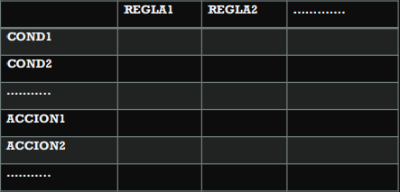

¿Cómo se llena la tabla?
- A partir de un enunciado se debe:
- Identificar las condiciones y las acciones.
- Completar la tabla teniendo en cuenta:
  - Si hay condiciones que son opuestas, debe colocarse una de ellas porque por la negativa se “obtendrá” la otra. (Si son n condiciones excluyentes, colocar n-1 en la tabla).
  - Las condiciones deben ser atómicas.
- Se construyen las reglas

Modelizar el problema de remisión de mercadería con las siguientes consideraciones

> Si el comprador no es cliente se imprime un mensaje de aviso y no se remite.
> Si no hay stock y el comprador es cliente no se remite.
> Si hay stock y el comprador es cliente se remite

Identificar las condiciones y las acciones

- Especificaciones completas
- Aquellas que determinan acciones (una o varias) para todas las reglas posibles.
- Especificaciones redundantes
- Aquellas que marcan para reglas que determinan las mismas condiciones acciones iguales.
- Especificaciones contradictorias
- Aquellas que especifican para reglas que determinan las mismas condiciones acciones
distintas

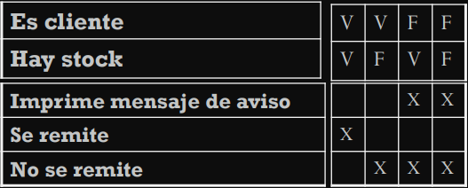

Redundancia y Contradicción

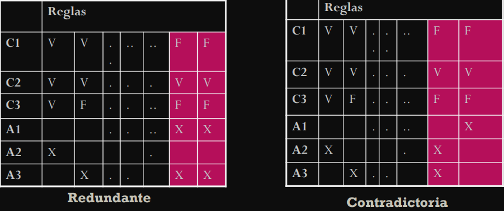

Reducción de Complejidad (Redundancia)
- Combine las reglas en donde sea evidente que una alternativa no representa una diferencia en el resultado.
- El guión [—] significa que la condición 2 puede ser S o N, y que aún así se realizará la acción.

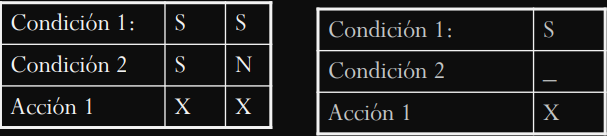

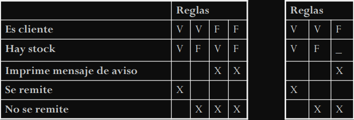

---

## Historias de Usuario

- Una historia de usuario es una representación de un requisito de software escrito en una o dos frases utilizando el lenguaje común del usuario.
- Son utilizadas en las metodologías de desarrollo ágiles para la especificación de requisitos
- Acompañadas de las discusiones con los usuarios y las pruebas de validación
- Debe ser limitada, esta debería poderse escribir sobre una nota adhesiva pequeña.
- Son una forma rápida de administrar los requisitos de los usuarios sin tener que elaborar gran cantidad de documentos formales y sin requerir de mucho tiempo para administrarlos.
- Permiten responder rápidamente a los requisitos cambiantes

Generalmente se espera que la estimación de tiempo de cada historia de usuario se sitúe entre unas 10 horas y un par de semanas
- Estimaciones mayores a dos semanas son indicativo de que la historia es muy compleja y debe ser dividida en varias historias.

Al momento de implementar las historias, los desarrolladores deben tener la posibilidad de discutirlas con los clientes.
Si bien el estilo puede ser libre, la historia de usuario debe responder a tres preguntas: 
- **¿Quién se beneficia?** El Rol
- **¿qué se quiere?** La Historia
- **¿cuál es el beneficio?** Esto es parte del cliente

Ejemplos

- Como (rol) quiero (algo) para poder (beneficio).
- Como usuario registrado deseo loguearme para poder poder empezar a utilizar la aplicación.

### Características
- **`Independientes unas de otras`** De ser necesario, combinar las historias dependientes o buscar otra forma de dividir las historias de manera que resulten independientes.
- **`Negociables`** La historia en si misma no es lo suficientemente explícita como para considerarse un contrato, la discusión con los usuarios debe permitir esclarecer su alcance y éste debe dejarse explícito bajo la forma de pruebas de validación.
- **`Valoradas por los clientes o usuarios`** Los intereses de los clientes y de los usuarios no siempre coinciden, pero en todo caso, cada historia debe ser importante para alguno de ellos más que para el desarrollador.
▪ **`Estimables`** Un resultado de la discusión de una historia de usuario es la estimación del tiempo que tomará completarla. Esto permite estimar el tiempo total del proyecto.
- **`Pequeñas`** Las historias muy largas son difíciles de estimar e imponen restricciones sobre la planificación de un desarrollo iterativo. Generalmente se recomienda la consolidación de historias muy cortas en una sola historia.
- **`Verificables`** Las historias de usuario cubren requerimientos funcionales, por lo que generalmente son verificables. Cuando sea posible, la verificación debe automatizarse, de manera que pueda ser verificada en cada entrega del proyecto.
- **``Beneficios``**
  - Al ser muy corta, ésta representa requisitos del modelo de negocio que pueden  implementarse rápidamente (días o semanas)
  - Necesitan poco mantenimiento
  - Mantienen una relación cercana con el cliente
  - Permite dividir los proyectos en pequeñas entregas
  - Permite estimar fácilmente el esfuerzo de desarrollo
  - Es ideal para proyectos con requisitos volátiles o no muy claros
- **`Limitaciones`**
  - Sin pruebas de validación pueden quedar abiertas a distintas interpretaciones haciendo difícil utilizarlas como base para un contrato
  - Se requiere un contacto permanente con el cliente durante el proyecto lo cual puede ser difícil o costoso
  - Podría resultar difícil escalar a proyectos grandes
  - Requiere desarrolladores muy competentes

---

## Casos de Uso

- Proceso de modelado de las “funcionalidades” del sistema en término de los evento que interactúan entre los usuarios y el sistema.
- Tiene sus orígenes en el modelado orientado a objetos (Jacobson 1992) pero su eficiencia en modelado de requerimientos hizo que se independice de la técnica de diseño utilizada, siendo aplicable a cualquier metodología de desarrollo.
- El uso de CU facilita y alienta la participación de los usuarios

### **`Beneficios`**
- Herramienta para capturar requerimientos funcionales
- Descompone el alcance del sistema en piezas mas manejables
- Medio de comunicación con los usuarios
- Utiliza lenguaje común y fácil de entender por las partes
- Permite estimar le alcance del proyecto y el esfuerzo a realizar
- Define una línea base para la definición de los planes de prueba
- Define una línea base para toda la documentación del sistema
- Proporciona una herramienta para el seguimiento de los requisitos

---

### **`Elementos del Modelo de Casos de Uso`**

#### **`Diagrama de Casos de Uso`** 

Ilustra las interacciones entre el sistema y los actores

#### **`Escenarios (narración del CU)`** 

Descripción de la interacción entre el actor y el sistema para realizar la funcionalidad

#### **`Elementos del Diagrama de Casos de Uso`**

- **Caso de Uso** Representa un objetivo (funcionalidad) individual del sistema y describe la secuencia de actividades y de interacciones para alcanzarlo. Para que el CU sea considerado un requerimiento debe estar acompañando de su respectivo escenario
- **Actores**
  - Un actor inicia una actividad (CU) en el sistema
  - Representa un papel desempeñado por un usuario que interactúa (rol)
  - Puede ser una persona, sistema externo o dispositivo externo que emita un evento (sensor, reloj)
- **Relaciones**
  - **`Asociaciones`** Relación entre un actor y un CU en el que interactúan entre sí 
  - **`Extensiones`** (Extends)
    - Un CU extiende la funcionalidad de otro CU
    - Un CU puede tener muchos CU extensiones
    - Los CU extensiones solo son iniciados por un CU
  - **`Uso o Inclusión`** (Uses) Reduce la redundancia entres dos o más CU al combinar los pasos comunes de los CU
  - **`Dependencia`** (Depends) Relación entre CU que indica que un CU no puede realizarse hasta que se haya realizado otro CU
  - **`Herencia`** Relación entre actores donde un actor hereda las funcionalidades de uno o varios actores

#### **Escenarios** (narración del CU)
- Conceptos Generales
- Descripción de la interacción del escenario
- Descripción de eventos alternativos

---

### Proceso de modelado
- Identificar a los actores
- Identificar los CU para los requerimientos
- Construir el diagrama
- Realizar los escenarios

---

#### Identificar a los actores

Dónde buscar actores potenciales
- Diagrama de contexto que identifique el alcance del sistema
- Documentación o manuales existentes
- Minutas de reunión
- Documentos de requerimientos

**Responder a**
- ¿Quién o qué proporciona las entradas al sistema?
- ¿Quién o qué recibe las salidas del sistema?
- ¿Se requieren interfaces con otros sistemas?
- ¿Quien mantendrá la información en el sistema?

Deberán nombrase con un sustantivo o frase sustantiva

---

#### Identificar los CU para los requerimientos
Responder a
- ¿Cuáles son las principales tareas del actor?
- ¿Qué información necesita el actor del sistema?
- ¿Qué información proporciona el actor al sistema?
- Necesita el sistema informar al actor de eventos o cambios ocurridos
- Necesita el actor informar al sistema de eventos o cambios ocurridos

---

#### Conceptos importantes
- Un CU debe representar una funcionalidad concreta
- La descripción de los pasos en los escenarios debe contener más de un paso, para representar la interacción entre los componentes
- El uso de condicionales en el curso normal, es limitado a la invocación de extenciones, ya que este flujo representa la ejecución del caso sin alteraciones
- Las pre condiciones no deben representarse el los cursos alternativos, ya que al ser una pre-condición no va a ocurrir
- Los “uses” deben ser accedidos por lo menos desde dos CU

---

## Maquinas de estado finito

Describe al sistema como un conjunto de estados donde el sistema reacciona a ciertos eventos posibles (externos o internos).
- f(Si, Cj) = Sk

Al estar en el estado Si, la ocurrencia de la condición Cj hace que el sistema cambie al estado Sk

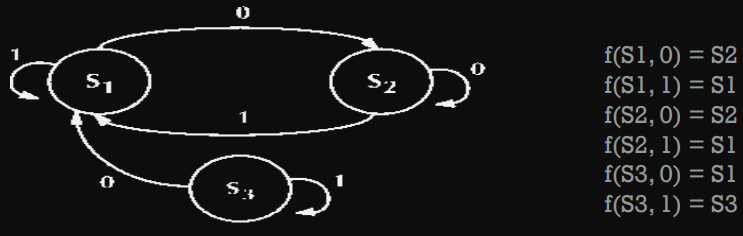

#### Definición formal
- Formalmente, un autómata finito (AF) puede ser descrito como una **`5-tupla (S,Σ,T,s,A)`** donde:
- **`Σ`** es un alfabeto;
- **`S`** un conjunto de estados;
- **`T`** es la función de transición;
- **`s`** es el estado inicial;
- **`A`** es un conjunto de estados de aceptación o finales. 

---

## DTE

### Construcción de un DTE
#### **`1)`** Identificar los estados
- Visualizando hora
- Visualizando fecha
- Visualizando funciones cronometro
- Cronometrando
- Configurando hora y fecha

#### **`2)`** Si hay un estado complejo se puede explotar

No es necesario

#### **`3)`** Desde el estado inicial, se identifican los cambios de estado con flechas

En este caso, el sistema inicia al colocarse la pila y pasaría al estado visualizando hora

#### **`4)`** Se analizan las condiciones y las acciones para pasar de un estado a otro

**Visualizando Hora**

- Se presiona B1 Visualiza la fecha
- Se presiona B2 Modificar la hora y fecha
- Se presiona B3 Visualiza el cronometro
- Se presiona B4 Enciende la luz

**Visualizando Fecha**

- Para visualizar la fecha se debe presionar el botón B1 y luego presionando B1 o B2 o B3 vuelve a visualizar la hora
- En Cualquier Momento se puede encender la luz con el botón B4

**Configurando Hora y Fecha**

- Se presiona B1 modifico el digito
- Se presiona B2 vuelve a visualizar la hora
- Se presiona B3 Modifico el digito a modificar: Hora, minuto, segundo, día, mes
- Se presiona B4 enciende la luz

Continuar con todos los estados

..

#### **`5)`** Se verifica la consistencia:
  - Se han definido todos los estados
  - Se pueden alcanzar todos los estados
  - Se pueden salir de todos los estados
  - En cada estado, el sistema responde a todas las condiciones posibles (normales y anormales)

--- 

#### Funciones
- Inicialmente (al colocar la pila) visualiza la hora prefijada
- Visualizar la hora
- Visualizar la fecha
- Modificar Hora y Fecha
- Encender la Luz por 5 seg.
- Iniciar / Detener / Resetear Cronometro
- Deja de funcionar al finalizarse la pila

---

## Redes de Petri

- Fueron inventadas por Carl Petri en la Universidad de Bonn, Alemania Occidental.
- Utilizadas para especificar sistemas de tiempo real en los que son necesarios representar aspectos de concurrencia.
- Los sistemas concurrentes se diseñan para permitir la ejecución simultánea de componentes de programación, llamadas tareas o procesos, en varios procesadores o intercalados en un solo procesador.
- Las tareas concurrentes deben estar sincronizadas para permitir la comunicación entre ellas (pueden operar a distintas velocidades, deben prevenir la modificación de datos compartidos o condiciones de bloqueo).
- Pueden realizarse varias tareas en paralelo, pero son ejecutados en un orden impredecible.
- Éstas NO son secuenciales.
- **`Sincronización`** Orquesta sinfónica
- Las tareas que ocurren en paralelo y se necesita alguna forma de controlar los eventos para cambiar de estado (**`Estación de servicios`**)

### EVENTOS o ACCIONES y ESTADOS o CONDICIONES

- Los eventos se representan como transiciones (T).
- Los estados se representan como lugares o sitios (P).

Caso más simple:
- f(EstadoA, Evento) -> EstadoS

Se requieren varios eventos para pasar de un estado a otro. Los eventos NO ocurren en un orden determinado.
-  f(EstadoA, Even1,Even2...EvenN)->EstadoS

Se requieren varios eventos para habilitar el paso del estado a otros varios estados que se ejecutan en paralelo.
- f(EstadoA, Even1,Even2...EvenN)-> Estado1, Estado2…, EstadoN

**`Definición Formal`** Una estructura de Red de Petri es una 4-upla
- C=(P, T, I, O)
  - **`P`** Lugares
  - **`T`** Transiciones
  - **`I`** Función de entrada, se representa con una I
  - **`O`** Función de salida, se representa con una O

Multigrafo (de un nodo puede partir más de un arco), bipartito, dirigido

**Definiciones**

- Los arcos indican a través de una flecha la relación entre sitios y transiciones y viceversa.
- A los lugares se les asignan tokens (fichas) que se representan mediante un número o puntos dentro del sitio. Esta asignación de tokens a lugares constituye la marcación.
- Luego de una marcación inicial se puede simular la ejecución de la red. El número de tokens asignados a un sitio es ilimitado.

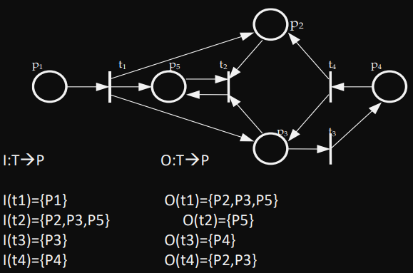

Otro ejemplo

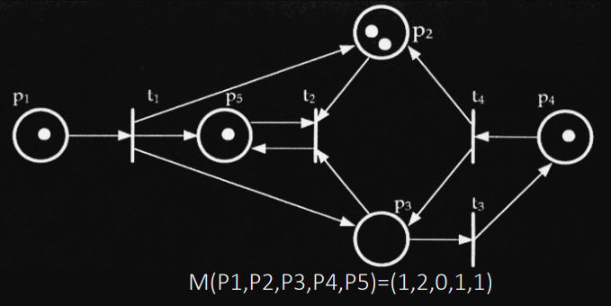

Explicación del ejemplo

- El conjunto de tokens asociado a cada estado sirve para manejar la coordinación de eventos y estados.
- Una vez que ocurre un evento, un token puede `“viajar”` de uno de los estados a otro.
- Las reglas de disparo provocan que los tokens `“viajen”` de un lugar a otro cuando se cumplen las condiciones adecuadas.
- La ejecución es controlada por el número y distribución de los tokens.
- La ejecución de una Red de Petri se realiza disparando transiciones habilitadas.
- Una transición está habilitada cuando cada lugar de entrada tiene al menos tantos tokens como arcos hacia la transición.
- Disparar una transición habilitada implica remover tokens de los lugares de entrada y distribuir tokens en los lugares de salida (teniendo en cuenta la cantidad de arcos que llegan y la cantidad de arcos que salen de la transición).

#### Transiciones

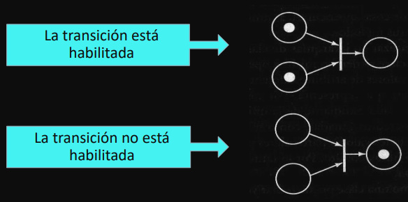 

- La ocurrencia de los eventos (transiciones) depende del estado del sistema.
- Una condición puede ser V (con token) o F (sin token)
- La ocurrencia de un evento está sujeta a que se den ciertas condiciones (pre) y al ocurrir el evento causa que se hagan verdaderas las post-condiciones.
- Las RP son asincrónicas y el orden en que ocurren los eventos es uno de los permitidos (La ejecución es NO DETERMINÍSTICA)
- Se acepta que el disparo de una transición es instantáneo

#### Paralelismo

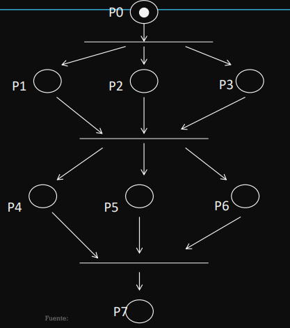

#### Sincronización
Para que varios procesos colaboren en la solución de un problema es necesario que compartan información y recursos pero esto debe ser controlado para asegurar la integridad y correcta operación del sistema.

#### Expresión de exclusión mutua

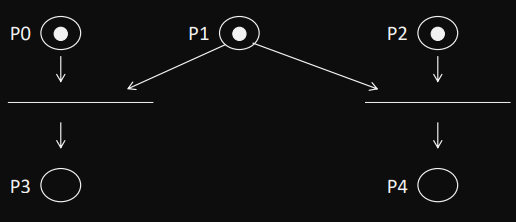

#### Productor - Consumidor

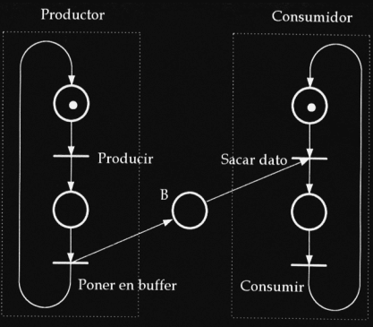

#### Condición de bloqueo

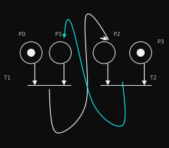