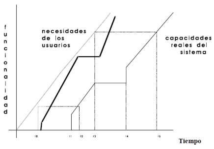

## Resumen Teorico

- [Modelo de Procesos Tradicionales]()
  - [Modelo en Cascada]()
  - [Modelo en V]()
  - [Modelo Prototipos]()
  - [Desarrollo por Fases]()
  - [Modelo espiral]()
  - [Analisis Comparativo]()
- [Modelo de Procesos Metodologias Agiles]()
  - [Extreme Programming]()
  - [Scrum]()

#### Modelo de Procesos Tradicionales

- **Proceso**
  Actividades que involucran, restricciones y recursos que producen una determinada salida
- **Características**
  - Establece todas las actividades
  - Utiliza recursos, está sujeto a restricciones y genera productos intermedios y finales
  - Puede estar compuesto por subprocesos
  - Cada actividad tiene entradas y salidas definidas
  - Las actividades se organizan en una secuencia
  - Existen principios que orientan sobre las metas de cada actividad
  - Las restricciones pueden aplicarse a una actividad, recurso o producto.
- **Ciclo de vida:** Proceso que implica la construcción de un producto
- **Ciclo de vida del Software:** Describe la vida del producto de software desde su concepción hasta su  implementación, entrega utilización y mantenimiento
- **Modelos de proceso de software:** Es una representación abstracta de un proceso del software.
  -  Modelo de proceso 
  -  Paradigma de software
  -  Ciclo de vida del software
  - Todos son Términos Equivalentes 
- **Modelos Prescriptivos:**
  - Prescriben un conjunto de elementos del proceso: actividades del marco de trabajo, acciones de la ingeniería del software, tareas, aseguramiento de la calidad y mecanismos de control.
  - Cada modelo de proceso prescribe también un “flujo de trabajo”, es decir de que forma los elementos del proceso se interrelacionan entre sí.
- **Modelos descriptivos:** Descripción en la forma en que se realizan en la realidad
- Ambos modelos deberían ser iguales

#### Modelo en Cascada

- Las etapas se representan cayendo en cascada
- Cada etapa de desarrollo se debe completar antes que comience la siguiente 
- Útil para diagramar lo que se necesita hacer
- Su simplicidad hace que sea fácil explicarlo a los clientes

#### Dificultades

- No existen resultados concretos hasta que todo este terminado.
- Las fallas más triviales se encuentran al comienzo del período de prueba y las más graves al final.
- La eliminación de fallas suele ser extremadamente difícil durante las últimas etapas de prueba del sistema.
- Deriva del mundo del hardware y presenta una visión de manufactura sobre el desarrollo de software.
- El software no se desarrolla de la misma manera
- La necesidad de prueba con la computadora aumenta exponencialmente durante las etapas 
-inales de prueba.
- "CONGELAR" una fase es poco realista.
- Existen errores, cambios de parecer, cambios en el ambiente

<table>
<tr><td>Modelo de la realidad</td><td>Con prototipo</td></tr>
<tr><td>

(Sin control entre las etapas)

</td><td>

</td></tr>
</table>

#### Modelo en V y Prototipos

<table>
<tr><td>Modelo en V</td><td>Modelo Prototipos</td></tr>
<tr><td>

- Demuestra como se relacionan las actividades de prueba con las de análisis y diseño.
- Sugiere que la prueba unitaria y de integración también sea utilizada para verificar el diseño del programa
- La vinculación entre los lados derecho e izquierdo implica que, si se encuentran problemas durante la verificación y validación, entonces el lado izquierdo de la V puede ser ejecutado nuevamente para solucionar el problema.
</td><td>

- Un prototipo es un producto parcialmente desarrollado que permite que clientes y desarrolladores examinen algunos aspectos del sistema propuesto, y decidan si éste es adecuado o correcto para el producto terminado.
- Esta es una alternativa de especificación para tratar mejor la incertidumbre, la ambigüedad y la volubilidad de los proyectos reales.
</td></tr>
<tr><td>

</td><td>

</td></tr>
</table>

### Modelo de Prototipos
#### Tipos
- **Evolutivos**
  - El objetivo es obtener el sistema a entregar.
  - Permite que todo el sistema o alguna de sus partes se construyan rápidamente para comprender o aclarar aspectos y asegurar que el desarrollador, el usuario y el cliente tengan una comprensión unificada tanto de lo que se necesita como de lo que se propone como solución
- **Descartables**
  - No tiene funcionalidad
  - Se utilizan herramientas de modelado

#### Proyectos candidatos
- Usuarios que no examinarán los modelos abstractos
- Usuarios que no determinarán sus requerimientos inicialmente
- Sistemas con énfasis en los formatos de E/S más que en los detalles algorítmicos
- Sistemas en los que haya que explorar aspectos técnicos
- Si el usuario tiene dificultad al tratar con los modelos gráficos para modelar los requerimientos y el comportamiento
- Si se enfatiza el aspecto de la interfaz humana

#### Para asegurar el éxito
- Debe ser un sistema con el que se pueda experimentar
- Debe ser comparativamente barato (< 10%)
- Debe desarrollarse rápidamente
- Énfasis en la interfaz de usuario
- Equipo de desarrollo reducido
- Herramientas y lenguajes adecuados

### Desarrollo por Fases

Se desarrolla el sistema de tal manera que puede ser entregado en piezas. Esto implica que existen dos sistemas funcionando en paralelo: el sistema operacional y el sistema en desarrollo.

<table>
<tr><td>Incremental</td><td> El sistema es particionado en subsistemas de acuerdo con su funcionalidad. Cada entrega agrega un subsistema.

</td></tr>
<tr><td>Interactivo</td><td>Entrega un sistema completo desde el principio y luego aumenta la funcionalidad de cada subsistema con las nuevas versiones

</td></tr>
</table>

### Modelo espiral (Boehm)

- Combina las actividades de desarrollo con la gestión del riesgo 
- Trata de mejorar los ciclos de vida clásicos y prototipos.
- Incorpora objetivos de calidad y gestión de riesgos
- Elimina errores y alternativas no atractivas al comienzo
- Permite iteraciones, vuelta atrás y finalizaciones rápidas
- **Cada ciclo empieza identificando**:
  - Los objetivos de la porción correspondiente
  - Las alternativas
  - Restricciones
- Cada ciclo se completa con una revisión que incluye todo el ciclo anterior y el plan para el siguiente

### Analisis Comparativo

<table>
<tr><td>Clasico</td><td>Incremental</td><td>Prototipo Evolutivo</td></tr>
<tr><td>

</td><td>

</td><td>

</td></tr>
</table>

## Modelo de Procesos Metodologias Agiles

La ingeniería de software ágil combina una filosofía y un conjunto de directrices de desarrollo.

- **La filosofía busca**
  - La satisfacción del cliente y la entrega temprana del software incremental
  - Equipos de proyectos pequeños y con alta motivación 
  - Métodos informales un mínimo de productos de trabajo de la ingeniería de software 
  - Una simplicidad en general
- **Las directrices resaltan**
  - La entrega sobre el análisis y el diseño, aunque estas actividades no se descartan
  - La comunicación activa y continua entre los desarrolladores y el cliente

El desarrollo ágil e software son métodos de ingeniería del software basados en el desarrollo iterativo e incremental, donde los requerimientos y soluciones evolucionan mediante la colaboración de grupo auto organizados y multidisciplinares. 

**Existen muchos métodos de desarrollo ágil**
- la mayoría minimiza riesgos desarrollando software en cortos lapsos de tiempo. 
- El software desarrollado en una unidad de tiempo es llamado una iteración, la cual debe durar de una a cuatro semanas. Cada iteración del ciclo de vida incluye: 
  - Planificación, análisis de requerimientos, diseño, codificación, revisión y documentación. 
  - Una iteración no debe agregar demasiada funcionalidad para justificar el lanzamiento del producto al mercado, pero la meta es tener una «demo» (sin errores) al final de cada iteración. 
  - Al final de cada iteración el equipo vuelve a evaluar las prioridades del proyecto.

La definición moderna de desarrollo ágil de software evolucionó a mediados de  los años 1990 y en el año 2001, miembros prominentes de la comunidad se reunieron en Snowbird, Utah, y se creo la “alianza ágil”, una organización sin fines de lucro que promueve el desarrollo ágil de aplicaciones y firmaron lo que se denomino el “Manifiesto para el desarrollo ágil de software”

#### **Manifiesto** 
Estamos descubriendo formas mejores de desarrollar software tanto por nuestra propia experiencia como ayudando a terceros. A través de este trabajo hemos aprendido a valorar:
- Individuos e interacciones sobre procesos y herramientas
- Software funcionando sobre documentación extensiva
- Colaboración con el cliente sobre negociación contractual
- Respuesta ante el cambio sobre seguir un plan

Esto es, aunque valoramos los elementos de la derecha, valoramos más los de la izquierda.

- **1)** Nuestra principal prioridad es satisfacer al cliente a través de la entrega temprana y continua de software de valor.
- **2)** Son bienvenidos los requisitos cambiantes, incluso si llegan tarde al desarrollo. Los procesos ágiles se doblegan al cambio como ventaja competitiva para el cliente.
- **3)** Entregar con frecuencia software que funcione, en periodos de un par de semanas hasta un par de meses, con preferencia en los periodos breves.
- **4)** Las personas del negocio y los desarrolladores deben trabajar juntos de forma cotidiana a través del proyecto.
- **5)** Construcción de proyectos en torno a individuos motivados, dándoles la oportunidad y el respaldo que necesitan y procurándoles confianza para que realicen la tarea.
- **6)** La forma más eficiente y efectiva de comunicar información de ida y vuelta dentro de un equipo de desarrollo es mediante la conversación cara a cara.
- **7)** El software que funciona es la principal medida del progreso.
- **8)** Los procesos ágiles promueven el desarrollo sostenido. Los patrocinadores, desarrolladores y usuarios deben mantener un ritmo constante de forma indefinida.
- **9)** La atención continua a la excelencia técnica enaltece la agilidad.
- **10)** La simplicidad como arte de maximizar la cantidad de trabajo que no se hace, es esencial.
- **11)** Las mejores arquitecturas, requisitos y diseños emergen de equipos que se autoorganizan.
- **12)** En intervalos regulares, el equipo reflexiona sobre la forma de ser más efectivo y ajusta su conducta en consecuencia.

### Extreme Programming

- Es una disciplina de desarrollo de software basado en los valores de la sencillez, la comunicación, la retroalimentación, la valentía y el respeto
- Su acción consiste en llevar a todo el equipo reunido en la presencia de prácticas simples, con suficiente información para que el equipo para ver dónde están y para ajustar las prácticas a su situación particular.
- En la programación extrema, cada colaborador del proyecto es una parte integral del " Equipo".
  - Las formas del equipo en torno a un representante de la empresa llama "el Cliente", que se sienta con el equipo y trabaja con ellos todos los días.
- Desarrollo iterativo e incremental: pequeñas mejoras, unas tras otras.
- Pruebas unitarias continuas, frecuentemente repetidas y automatizadas, incluyendo pruebas de regresión.
- Programación en parejas
- Frecuente integración del equipo de programación con el cliente o usuario.
- Corrección de todos los errores antes de añadir nueva funcionalidad.
- Refactorización del código
- Propiedad del código compartida
- Simplicidad en el código

### Scrum

- Scrum es un proceso en el que se aplican, de manera regular, un conjunto de mejores prácticas para trabajar en equipo y obtener el mejor resultado posible de un proyecto.
- Estas prácticas se apoyan unas a otras y su selección tiene origen en un estudio de la manera de trabajar de equipos altamente productivos.
- En Scrum se realizan entregas parciales y regulares del resultado final del proyecto, priorizadas por el beneficio que aportan al receptor del proyecto

- **Eliminar el desperdicio** No generar artefactos, ni perder el tiempo haciendo cosas que no le suman valor al cliente.
- **Construir la calidad con el producto** La idea es inyectar la calidad directamente en el código desde el inicio.
- **Crear conocimiento** En la práctica no se puede tener el conocimiento antes de empezar el desarrollo.
- **Diferir las decisiones** Tomar las decisiones en el momento adecuado, esperar hasta ese momento, ya que uno tiene mas información a medida que va pasando el tiempo. Si se puede esperar, mejor.
- **Entregar rápido** Debe ser una de las ventajas competitivas más importantes.
- **Respetar a las personas** La gente trabaja mejor cuando se encuentra en un ambiente que la motive y se sienta respetada.
- **Optimizar el todo** Optimizar todo el proceso, ya que el proceso es una unidad, y para lograr tener éxito y avanzar, hay que tratarlo como tal.
- **El Product Owner (Propietario)** Conoce y marca las prioridades del proyecto o producto.
- **El Scrum Master (Jefe)** Es la persona que asegura el seguimiento de la metodología guiando las reuniones y ayudando al equipo ante cualquier problema que pueda aparecer. Su responsabilidad es entre otras, la de hacer de paraguas ante las presiones externas.
- **El Scrum Team (Equipo)** Son las personas responsables de implementar la funcionalidad o funcionalidades elegidas por el Product Owner.
- **Los Usuarios o Clientes** Son los beneficiarios finales del producto, y son quienes viendo los progresos, pueden aportar ideas, sugerencias o necesidades
- **Product Backlog** Es la lista maestra que contiene toda la funcionalidad deseada en el producto. La característica más importante es que la funcionalidad se encuentra ordenada por un orden de prioridad.
- **Sprint Backlog** Es la lista que contiene toda la funcionalidad que el equipo se comprometió a desarrollar durante un Sprint determinado.
- **Burndown Chart** Muestra un acumulativo del trabajo hecho, día-a-día.
- Entre otros… 

**Scrum es iterativo e incremental**
- Se busca poder atacar todos los problemas que surgen durante el desarrollo del proyecto
- El nombre Scrum se debe a que durante los Sprints, lo que serían las fases de desarrollo, se solapan, de manera que no es un proceso de cascada por cada iteración, si no que tenemos todas éstas etapas juntas que se ejecutan una y otra vez, hasta que se crea suficiente.
- Este solapamiento de fases se puede asemejar a un scrum de rugby, en el cual todos los jugadores (o roles, en nuestro caso), trabajan juntos para lograr un objetivo.

- Scrum está pensado para ser aplicado en proyectos en donde el caos es una constante, aquellos proyectos en los que tenemos requerimientos dinámicos, y que tenemos que implementar tecnología de punta.
- Esos proyectos difíciles, que con los enfoques tradicionales se hace imposible llegar a buen puerto.

## Desarrollo de software dirigido por Modelos

- Hacia fines de los 70’ DeMarco introdujo el concepto de desarrollo de software «basado», en modelos.
- Destacó que la construcción de un sistema de software debe ser precedida por la construcción de un modelo, tal como se realiza en otros sistemas ingenieriles.
- Un modelo del sistema consiste en una conceptualización del dominio del problema y actúa como una especificación precisa de los requerimientos que el sistema de software debe satisfacer. (Abstracción de elementos del problema, comunicación, negociación con el usuario)
- El adjetivo «dirigido» en MDD, a diferencia de «basado», enfatiza que este paradigma asigna a los modelos un rol central y activo: son al menos tan importantes como el código fuente
- Model Driven Development (MDD) promueve enfatizar los siguientes puntos claves:
  - Mayor nivel de abstracción en la especificación tanto del problema a resolver como de la solución correspondiente.
  - Aumento de confianza en la automatización asistida por computadora para soportar el análisis, el diseño y la ejecución.
  - Uso de estándares industriales como medio para facilitar las comunicaciones, la interacción entre diferentes aplicaciones y productos, y la especialización tecnológica.
  - Los modelos son los conductores primarios en todos los aspectos del desarrollo de software.

 

### Modelos y Transformaciones Automaticas

- **PIM - Platform Independent Model** “Un modelo de un sistema que no contiene información acerca de la plataforma o la tecnología que es usada para implementarlo” 
- **PSM - Platform Specific Model**  “Un modelo de un sistema que incluye información acerca de la tecnología especifica que se usará para su implementación sobre una plataforma especifica” 
- **Transformación de modelos** “Especifica el proceso de conversión de un modelo en otro modelo del mismo sistema.
- **Transformación**
  - En general, se puede decir que una definición de transformación consiste en una colección de reglas, las cuales son especificaciones no ambiguas de las formas en que un modelo (o parte de él) puede ser usado para crear otro modelo (o parte de él).
  - El patrón MDD es normalmente utilizado sucesivas veces para producir una sucesión de transformaciones.
- **Beneficios de MDD**
  - Incremento en la productividad (modelos y transformaciones).
  - Adaptación a los cambios tecnológicos.
  - Adaptación a los cambios de requisitos
  - Consistencia (automatización).
  - Re-uso (de modelos y transformaciones).
  - Mejoras en la comunicación con los usuarios y la comunicación entre los desarrolladores (los modelos permanecen actualizados).
  - Captura de la experiencia (cambio de experto).
  - Los modelos son productos de larga duración (resisten cambios).
  - Posibilidad de demorar decisiones tecnológicas.

<table><td>

</td><td>

</td></table>

## Calidad

- ¿Qué es la calidad? rta : La calidad es la capacidad de un producto o servicio para satisfacer las necesidades del usuario.
- Las principales normas internacionales definen la calidad como :
  - “El grado en el que un conjunto de características inherentes cumple con los requisitos “ ( ISO 9000)
  - “Conjunto de propiedades o características de un producto o servicio que le confieren aptitud para satisfacer unas necesidades expresadas o implicitas” (ISO
  8402)

Reconocimiento del mercado - Autos (Nivel de confianza)
- calidad 
  - **1.f)** Propiedad o conjunto de propiedades inherentes a algo, que permiten juzgar su valor. “Esta tela es de buena calidad”.
  - **2.f)** Buena calidad, superioridad o excelencia. “ La calidad del vino de Jerez ha conquistado los mercados”.
  - **3.f)** Carácter, genio, índole.
  - **4.f)** Condición o requisito que se pone en un contrato.
  - **5.f)** Estado de una persona, naturaleza, edad y demás circunstancias y condiciones que se requieren para un cargo o dignidad.
> Se ve una serie de definiciones relacionadas, la mas destacable es la primera donde se habla de “propiedades que pueden ser juzgadas” de ahí se desprende que la calidad es un termino totalmente subjetivo, que va a depender del juicio de la persona que intervenga en la evaluación.

#### Definición de calidad

- A lo largo de la historia se han desarrollado filosofías o culturas de calidad, de las cuales algunas han sobresalido porque han tenido resultado satisfactorios.
- A los que realizaron estas filosofías se los ha llamado Maestros o Gurús de la Calidad

#### Historia de la Calidad

- La revolución industrial abrió camino en la producción, distribución de productos y de servicios.
- En unos tiempos de crecimiento era necesario la comprobación de las piezas o servicios, es decir, el control de los procesos, antes y durante la fabricación, y a raíz de esto fueron apareciendo nuevas y varias funciones de Control De Calidad.
- Se indica que el Control De Calidad tuvo el inicio en 1916, cuando las empresas Western Electric y la Bell Telephone unieron esfuerzos e investigaciones para la fabricación de teléfonos que pudiesen resistir con gran fiabilidad el duro uso del público.
- En 1946 se creó la American society for Quality, una central de divulgación de la información en los temas de control de la Calidad. 
- En 1950, en Japón, con la ayuda de W. Edwards Deming adoptó una metodología dirigida hacia el usuario, fabricando productos de calidad, es decir, - Haciendo bien las cosas a la primera -. Este estilo de metodología se iniciaba en la alta Dirección y luego extendiéndose a todos los niveles de la empresa.➔ TQM
- Toda la Concientización y el seguimiento de la calidad en el producto y losprocesos ha dado lugar a un buen control de calidad, planificación de la inspección, controles estadísticos, análisis de reclamaciones del mercado, prevención de los defectos y fallos, ingeniería de Calidad, fiabilidad, análisis de costes, cero defectos, control total de la Calidad, seguimiento de las ventas, aseguramiento de la Calidad, auditorias y sistemas de información de la Calidad.

#### Calidad de los sistemas de Información

- La importancia de los sistemas de información (SI) en la actualidad hace necesario que las empresas de tecnología hagan mucho hincapié en los estándares de calidad.
- Stylianou y Kumar plantean que se debe apreciar la calidad desde un todo, donde cada parte que la componen debe tener su análisis de calidad. 

#### Componentes

- **Calidad de la Infraestructura** incluye, por ejemplo, la calidad de las redes, y sistemas de software.
- **Calidad de Software** de las aplicaciones de software construidas, o mantenidas, o con el apoyo de IS.
- **Calidad de Datos** Que ingresan en el sistema de información.
- **Calidad de Información** está relacionada con la calidad de los datos.
- **Calidad de gestión** incluye el presupuestó , planificación y programación.
- **Calidad de servicio** incluye los procesos de atención al cliente

#### Calidad de software

- La calidad del software se ha mejorado significativamente en esto últimos años, en particular por una mayor conciencia de la importancia de la gestión de la calidad y la adopción de técnicas de gestión de la calidad para desarrollo en la industria del software
- Se divide en
  - Calidad del producto obtenido
  - Calidad del proceso de desarrollo
- **Producto**
  - Un producto es un bien tangible que es el resultado de un proceso.
  - Aunque el software tiene aspectos intangibles, un producto software es sin embargo un bien en sí mismo e incluye sus documentos asociados.
  - La estandarización del producto define las propiedades que debe satisfacer el producto software resultante.
- **Proceso** La estandarización del proceso define la manera de desarrollar el producto software
> Sin un buen proceso de desarrollo es casi imposible obtener un buen producto.

#### Clasificación de normas y modelos de calidad

#### Modelo de calidad Square ISO/IEC 25000

- **ISO/IEC 2500n – División gestión de la calidad**
  - ISO/IEC 25000:2005 - Guide to SQuaRE:
  - ISO/IEC 25001:2007 - Planning and Management.
- **ISO/IEC 2501n – División modelos de calidad**
  - ISO/IEC 25010 - System and software quality models
  - ISO/IEC 25012 - Data Quality model
- **ISO/IEC 2502n – División de medición de calidad**
  - ISO/IEC 25020 - Measurement reference model and guide
  - ISO/IEC 25021 - Quality measure elements
  - ISO/IEC 25022 - Measurement of quality in use
  - ISO/IEC 25023 - Measurement of system and software product quality. 
  - ISO/IEC 25024 - Measurement of data quality
- **ISO/IEC 2503n – División Requerimientos de calidad**
  - ISO/IEC 25030 - Quality requirements
- **ISO/IEC 2504n – División Evaluación de la calidad**
  - ISO/IEC 25040 - Evaluation reference model and guide
  - ISO/IEC 25041 - Evaluation guide for developers, acquirers and independent evaluators
  - ISO/IEC 25042 - Evaluation modules.
  - ISO/IEC 25045 - Evaluation module for recoverability

#### Modelo de calidad Square ISO/IEC 25010

#### Calidad de los Datos ISO/IEC 25012

- **La norma entiende por calidad de datos:** La capacidad de las características de los datos de satisfacer necesidades explícitas e implícitas bajo determinadas condiciones de uso.
- Los clasifica estas características de calidad considerando dos puntos de vista:
- **Inherente**
  - Capacidad de las características de los datos de tener el potencial intrínseco para satisfacer las necesidades explícitas e implícitas
  - Este punto de vista está más relacionado con los aspectos del dominio gestionados por los expertos del negocio.
- **Dependiente del sistema:**
  - Capacidad del sistema informático de alcanzar y preservar la calidad de los datos cuando los datos se utilizan en determinadas condiciones
  - Este punto de vista suele ser responsabilidad de los técnicos del sistema.

#### Square - Proceso de Evaluación - ISO/IEC 25040
- **1)** Establecer los requisitos de la evaluación
  - **1)** Establecer el propósito de la evaluación
  - **2)** Obtener los requisitos de calidad del producto
  - **3)** Identificar las partes del producto que se deben evaluar
  - **4)** Definir el rigor de la evaluación
- **2)** Especificar la evaluación
  - **1)** Seleccionar los módulos de evaluación
  - **2)** Definir los criterios de decisión para las métricas
  - **3)** Definir los criterios de decisión de la evaluación
- **3)** Diseñar la evaluación
  - **1)** Planificar las actividades de la evaluación
- **4)** Ejecutar la evaluación
  - **1)** Realizar las mediciones
  - **2)** Aplicar los criterios de decisión para las métricas
  - **3)** Aplicar los criterios de decisión de la evaluación
- **5)** Finalizar la evaluación
  - **1)** Revisar los resultados de la evaluación
  - **2)** Crear el informe de evaluación
  - **3)** Revisar la calidad de la evaluación y obtener feedback
  - **4)** Tratar los datos de la evaluación

#### Modelo de Calidad de Proceso de Software ISO 12207/ ISO15504

#### Modelo de Calidad de Proceso de Software CMM-CMMI

- En diciembre de 2000, el SEI publicó un nuevo modelo, el CMMI o "Modelo de Capacidad y Madurez - Integración", con el objetivo de realizar algunas mejoras respecto al SW-CMM (e integrarlo con el SE-CMM y el IPD-CMM, que pasaron a ser considerados como "obsoletos").
- Incluye cuatro disciplinas, Software, Ingeniería de sistemas , Desarrollo integrado de procesos y productos y Gestión de proveedores .
- A su vez incorpora una nueva representación, "Continua", la que permite evaluar el nivel en cada área independientemente.
- El SEI ha desarrollado también un nuevo método de evaluación de las organizaciones según CMMI denominado SCAMPI.

Sistema de Gestión de la Calidad – ISO/IEC 9001

#### SGC - IRAM - ISO 9001

SGC – Mejora Continua

'

#### ISO 9000 y el Desarrollo de Software

- **IRAM – ISO 9001:2015** Aplicación genérica
- **ISO 90003:2018**
  - Directrices para la interpretación en el proceso de software
  - Proporciona una guía para identificar la evidencias dentro del proceso de software para satisfacer los requisitos de la ISO 9001

#### Resumen General

- **Conceptos generales**
  - Definición de software. / Características del software. / Historia
  - Definiciones de Ingeniería de software y conocimientos que debe tener un ingeniero de software.
  - Responsabilidad profesional y ética
  - Participantes en el desarrollo de software.
- **Problemas de Comunicación**
  - Desarrollador
  - Cliente
  - Puntos de vista
- **Elicitacion de requerimientos**
- **Técnicas de elicitacion de requerimientos**
  - Entrevistas
  - Cuestionarios
  - Muestreo de la documentación, las formas y los datos existentes
  - Investigación y visitas al lugar
  - Observación del ambiente de Trabajo
  - Planeación conjunta de Requerimientos (JRP o JAD)
  - Lluvia de Ideas - Brainstorming
- **Definición de Requerimientos**
- **Ingeniería de Requerimientos**
  - Viabilidad
  - Obtención
  - Especificación
  - Validación
- **Clasificación de requerimientos**
  - Funcionales
  - No Funcionales
- Técnicas de especificación de requerimientos
  - **Estáticas**
    - Referencia indirecta / Relaciones de recurrencia / Definición axiomática / Expresiones regulares
  - **Dinámicas**
    - Tablas de decisión / Diagramas de transición de estados / Redes de Petri / Casos de Uso/ Historias de Usuarios
- **Modelos proceso**
  - Definición de procesos - Prescriptivos/Descriptivos
  - Modelo en Cascada / Modelo en V / Modelo de Prototipos / Desarrollo por fases / El modelo espiral
- **Metodologías agiles**
  - Valores / Principios / XP / Scrum
- **Desarrollo de Software Dirigido por Modelos**
  - PIM/PSM/Transformaciones
- **Calidad de Software**
  - Definiciones/ Modelos holístico de la calidad Calidad de Producto / Calidad de Procesos /Estándares 